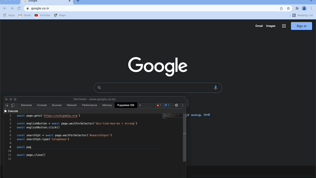

# Puppeteer IDE Extension

 
 

Develop, test and execute puppeteer scripts from browser's developer tools.

<br>

## Installation
This extension is published on chrome web store. [Click here](https://chrome.google.com/webstore/detail/puppeteer-ide/ilehdekjacappgghkgmmlbhgbnlkgoid) to view extension on chrome web store.

<br>

## Usage

This extension will add an extra tab named "Puppeteer IDE" in browser's developer tools from where you can write and execute puppeteer script.

You can access [page](https://pptr.dev/#?product=Puppeteer&version=v13.0.0&show=api-class-page) instance variable directly for the tab in which developer tools is opened. On clicking `Execute` button, the script will be executed on the inspected tab.

The editor will take the theme of developer tools. [Here is the guide](https://developer.chrome.com/docs/devtools/customize/dark-theme/) which shows how to customize developer tool's theme.



<br>

In the [assets](assets) folder you can check screenshots and gif of this extension being used.

<br>

## Build From Source

To build extension from source :-
```
git clone https://github.com/gajananpp/puppeteer-ide-extension

cd puppeteer-ide-extension

npm install

npm run dist
```
This will output extension in dist folder which you can load in your browser by following this [steps](https://developer.chrome.com/docs/extensions/mv3/getstarted/#:~:text=The%20directory%20holding%20the%20manifest%20file%20can%20be%20added%20as%20an%20extension%20in%20developer%20mode%20in%20its%20current%20state.).

<br>

## FAQ

**Q: Does this extension have any external dependency ?**
<br>
No. This extension internally uses [chrome.debugger](https://developer.chrome.com/docs/extensions/reference/debugger/) api and is standalone, so there is no requirement of starting browser with remote debugging cli flag or having nodejs or any other service installed. 

<br>

**Q: On which browsers can this extension be installed ?**
<br>
This extension only works with chrome and other chromium based browsers like edge/brave.

<br>

**Q: From where can this extension be installed ?**
<br>
This extension is published on chrome web store. You can add this extension from [here](https://chrome.google.com/webstore/detail/puppeteer-ide/ilehdekjacappgghkgmmlbhgbnlkgoid). 

<br>

**Q: How can be puppeteer script executed in extension ?**
<br>
Check out [puppeteer-extension-transport](https://github.com/gajananpp/puppeteer-extension-transport) package.

<br>
