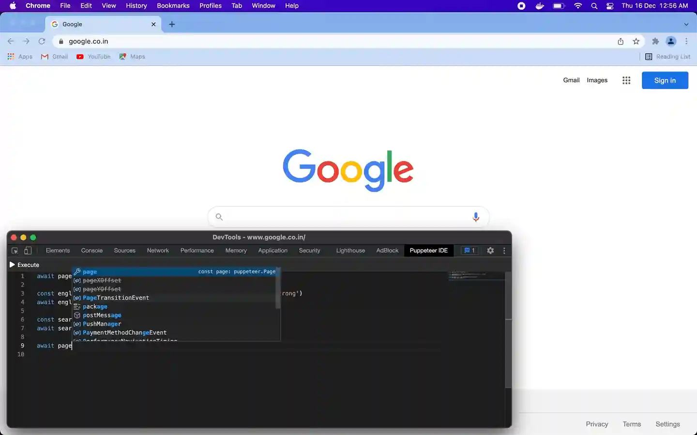
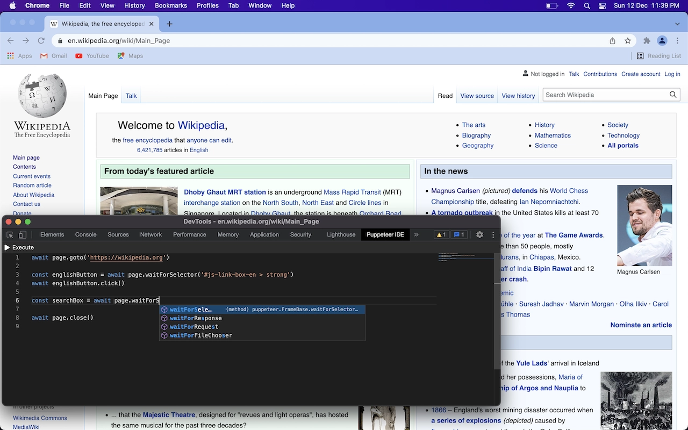
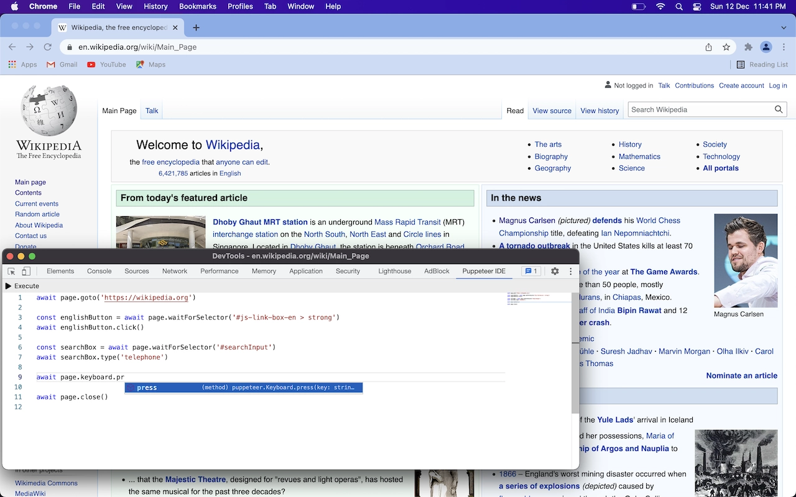

<div align="center">

# Puppeteer IDE Extension

 
 

A standalone extension to develop, test and execute puppeteer scripts from browser's developer tools.

[Installation](#installation) •
[Usage](#usage) •
[Screenshots](#screenshots) •
[Build From Source](#build-from-source) •
[Privacy](#privacy) •
[Todo](#todo) •
[FAQs](#faq)




</div>


## Installation
This extension is published on chrome web store.

[](https://chrome.google.com/webstore/detail/puppeteer-ide/ilehdekjacappgghkgmmlbhgbnlkgoid)

## Usage

This extension will add an extra tab named "Puppeteer IDE" in browser's developer tools from where you can write and execute puppeteer scripts.

Use [page](https://pptr.dev/#?product=Puppeteer&version=v13.0.0&show=api-class-page) instance variable directly for the tab in which developer tools is opened. 

On clicking `Execute` button, the script will be executed on the inspected tab.

The script will be auto saved as it is being edited.

## Screenshots

Dark theme :- 



Light theme :- 



## Build From Source

To build extension from source :-
```
git clone https://github.com/gajananpp/puppeteer-ide-extension

cd puppeteer-ide-extension

npm install

npm run dist
```
This will output extension in dist folder which you can load in your browser by following this [steps](https://developer.chrome.com/docs/extensions/mv3/getstarted/#:~:text=The%20directory%20holding%20the%20manifest%20file%20can%20be%20added%20as%20an%20extension%20in%20developer%20mode%20in%20its%20current%20state.).

## Privacy
This extension is standalone. **It doesn't make any external api calls**. You can inspect network of page/extension and source code in this repo.

## Todo

- [x] Add multi tab/script support.
- [x] Add theme switch.
- [x] Print unhandled errors in console tab of inspected window.
- [x] Suggesting xPath of currently selected element when `$0` typed in editor.
- [ ] Binding keyboard shortcut with script for execution without devtools opened.
- [ ] Adjustable delay in execution.
- [ ] Show used/available chrome storage space.


## FAQ

**Q: Does this extension have any external dependency ?**
<br>
No. This extension internally uses [chrome.debugger](https://developer.chrome.com/docs/extensions/reference/debugger/) api and is standalone, so there is no requirement of starting browser with remote debugging cli flag or having nodejs or any other service running. 

<br>

**Q: On which browsers can this extension be installed ?**
<br>
This extension only works with chrome and other chromium based browsers like edge, brave etc.

<br>

**Q: Execution stops abruptly when page navigates ?**
<br>
Some other extensions may cause this issue, especially 3rd party extensions which are added by desktop applications. One particular extension is `Adobe Acrobat` which is added by Adobe's desktop application.
You can disable this extension and try again executing.

<br>

**Q: From where can this extension be installed ?**
<br>
This extension is published on chrome web store. Click on below button to view it in chrome web store.

[](https://chrome.google.com/webstore/detail/puppeteer-ide/ilehdekjacappgghkgmmlbhgbnlkgoid)

<br>

**Q: How can be puppeteer script executed in extension ?**
<br>
Check out [puppeteer-extension-transport](https://github.com/gajananpp/puppeteer-extension-transport) package.

<br>
